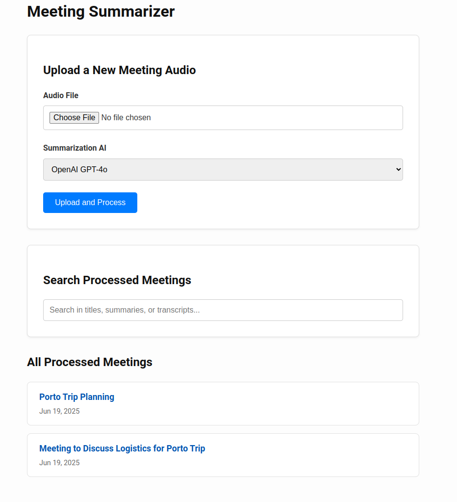
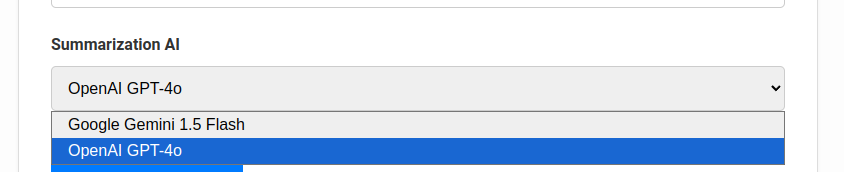

# AI Meeting Summarizer

A simple, self-hosted web application to record, transcribe, and summarize your meetings. Upload an audio file of your meeting, and this tool will use OpenAI's Whisper for highly accurate transcription, then provide a structured summary using your choice of AI provider: **Google Gemini** or **OpenAI GPT**.



## Features

- **Easy Web Interface:** Simple and clean UI for uploading audio files.
- **State-of-the-Art Transcription:** Uses OpenAI's Whisper for fast and accurate audio-to-text conversion.
- **Dual AI Provider Support:** Choose between Google Gemini or OpenAI GPT-4o for summarization on a per-upload basis.
- **Structured Summaries:** The AI is prompted to provide a consistent summary format, including:
  - A generated meeting title
  - Key discussion points
  - Decisions made
  - Action items
- **Meeting Directory:** A browsable and searchable list of all your processed meetings.
- **Keyword Search:** Quickly find relevant meetings by searching through titles, summaries, and full transcripts.

> ⚠️ **Note:** Only audio files are supported. Allowed formats: `.wav`, `.mp3`, `.m4a`, `.ogg`, and `.mp4`. Video files like `.mp4` are accepted only for extracting their audio content.

## Tech Stack

- **Backend:** Python 3, Flask
- **Transcription:** [OpenAI Whisper](https://github.com/openai/whisper)
- **AI Summarization:** [Google Gemini API](https://ai.google.dev/), [OpenAI API](https://platform.openai.com/)
- **Frontend:** Simple HTML & CSS
- **Containerization:** Docker, Docker Compose

---

## 🚀 Quick Start (Docker)

This is the recommended way to run the project.

### 1. Clone the Repository

```bash
git clone https://github.com/renantmagalhaes/meeting-summarizer.git
cd meeting-summarizer
```

### 2. Configure Your API Keys

Copy the `.env.example` to `.env` and update it with your real keys:

```bash
cp .env.example .env
```

Edit `.env`:

```env
GOOGLE_API_KEY="YOUR_GOOGLE_AI_API_KEY_HERE"
OPENAI_API_KEY="YOUR_OPENAI_API_KEY_HERE"
```

### 3. Start the App

```bash
docker-compose up --build
```

Then open your browser at: [http://localhost:5000](http://localhost:5000)

---

## ⚙️ Optional: Local Python Setup (Non-Docker)

If you'd prefer to run it without Docker:

1. Install Python 3.10–3.12 and `ffmpeg`
2. Create and activate a virtual environment
3. Run:

```bash
pip install -r requirements.txt
python app.py
```

This is useful for debugging or tweaking code without rebuilding containers.

---

## 📁 File Structure

```
.
├── app.py                 # Main Flask app
├── requirements.txt       # Python dependencies
├── Dockerfile             # Docker image
├── docker-compose.yml     # Container orchestration
├── .env.example           # API key config template
├── templates/             # HTML templates
│   ├── index.html
│   └── result.html
└── static/                # (optional) styles, JS, etc.
```

---

## 🔐 Environment Variables

This app requires API keys to function. You'll need to set:

- `GOOGLE_API_KEY` — from [Google AI Studio](https://makersuite.google.com/app)
- `OPENAI_API_KEY` — from [OpenAI Dashboard](https://platform.openai.com/account/api-keys)

These can be set via a `.env` file or directly in the environment.

## 

## 📌 Notes

- Whisper is called locally; make sure your system or container includes `ffmpeg`.
- Summarization is cloud-based and will consume your OpenAI/Gemini credits.
- Accuracy and output quality will depend heavily on audio clarity.

---

## 📅 Roadmap

- [ ] Support audio recording directly in-browser
- [ ] Add support for other AI providers (Claude, Mistral)
- [ ] Multi-language transcription & summarization
- [ ] User authentication and multi-user support

---

## License

MIT License. Do whatever you want, but attribution is appreciated.

---

**Made with ❤️ by Renan**
